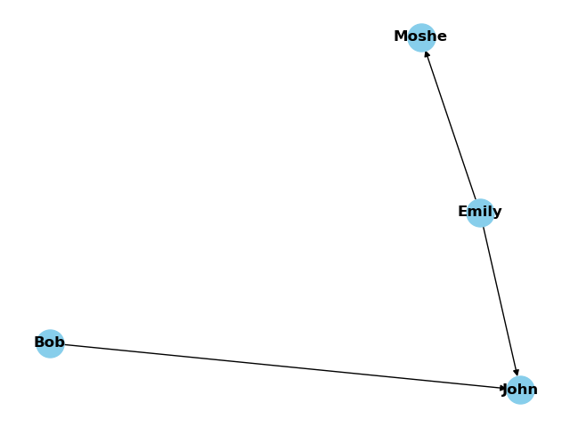

# FINAL_PROJ
FINAL_PROJ

1. To create sets: see generate_arrangements.py

2. To create a single passage of some kind (multi/single, disambiguate/ambiguous)
    uncomment the lines in the bottom of arrangements_generator/single_choice_generator.py, arrangements_generator/multi_choice_generator.py

3. Drawing graph can be done using the arrangements generator's generate_passage routine with the *draw_graph* flag:
    `generator.generate_passage(graph, draw_graph=True)` .

This will create:

